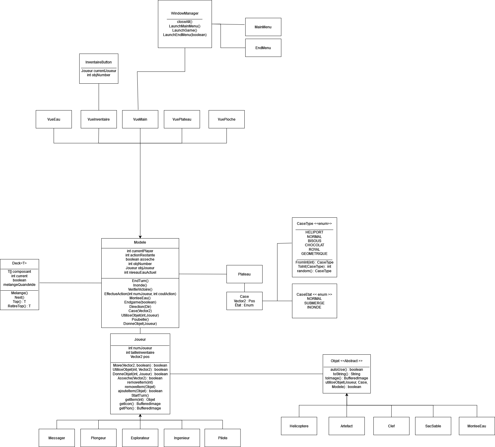

# L'île interdite

## Utilisation

Pour se déplacer, il suffit de cliquer sur une case. Si le pion qui est actuellement en train de jouer (Celui entouré en vert) peut s'y rendre, alors il s'y rendra. Pour assécher une case, cocher l'option 'Assécher', puis cliquer sur celle-ci. On peut également se déplacer avec les flêches, mais attention l'explorateur ne pourra pas les utiliser pour se déplacer en diagonale.
A drotie de l'écran, on peut voir l'inventaire de chacun des joueurs. Pour utiliser un objet, séléctionner ce dernier puis séléctionner la case sur laquelle l'utiliser. Pour donner un objet a un autre joueur, séléctionner l'objet puis cliquer sur l'icone de personnage de l'inventaire du joueur a qui le donner. Pour jeter un objet, cliquer sur l'objet puis sur le bouton 'Poubelle'.

L'objectif du jeu est de récupérer les 4 artefacts, puis de s'échapper a l'aide de l'héliport. Pour ce faire, il faut utiliser les clés sur les temples correspondant. Pour utiliser une clé, il faut se trouver sur le temple correspondant a la clef, puis utiliser l'objet 'clef' sur cette dernière.

## Organisation des dossiers

Le projet est organisé en deux dossier : src, qui contient l'intégralité du code source, et img qui contient les images utilisé dans le jeu.

## Organisation du projet

L'intégralité du sujet a pû être traitée dans le sujet. Les détails de l'organisation du projet peuvent être retrouvé dans le diagramme UML suivant:

## Voie d'améliorations

Avec du temps suplémentaire, il m'aurait été possible d'implémenter les features qui n'ont pas pu l'être présent dans le fichier 'TODO.md'.

## Note

Les images ont été réalisé entièrement pour ce projet, mais on pû être réalisé avec d'autres images de références.